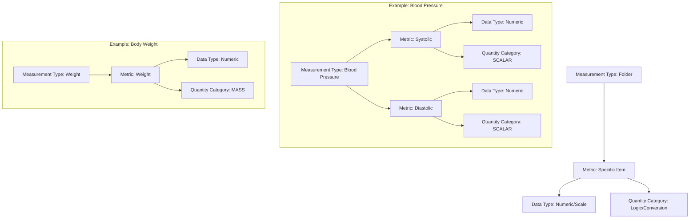

# Project Vital: Invest in Yourself

Project Vital is a Spring Boot application designed to track and manage personal health vitals.

## Development Environments

| Command | Description | Dockerized | Deploy Target | Database |
| :--- | :--- | :--- | :--- | :--- |
| `make run-local` | Fast native development | No | Local | Local Postgres (`localhost`) |
| `make run-dev` | Native run with Supabase Dev | No | Local | Supabase (Dev Project) |
| `make up-dev` | **One-stop-shop** (JAR + Docker + Run) | **Yes** | Local | Supabase (Dev Project) |
| `make up-prod` | **One-stop-shop** (JAR + Docker + Run) | **Yes** | Local | Supabase (Prod Project) |
| `make gcp-deploy` | Production Cloud Deployment | **Yes** | **Cloud (GCP)** | Supabase (Prod Project) |

## Swagger

`http://localhost:8080/swagger-ui.html`

## Quick Start
1. **Dependencies**: `make install`
2. **Local DB**: Ensure Postgres is running on `localhost:5432` with a `projectvital` database.
3. **Secrets**: Create a `.env` file based on `.env.template` with your **Supabase Dev Project** keys.
4. **Run**: `make run-local` for native development or `make run-dev` to use Supabase.

## Database

### Local setup

```sql
-- 1. Create role
CREATE ROLE "user" WITH LOGIN PASSWORD 'password';

-- 2. Create database
CREATE DATABASE projectvital OWNER "user";

-- 3. Grant privileges (safe even if owner already)
GRANT ALL PRIVILEGES ON DATABASE projectvital TO "user";

-- 4. Connect to your specific database first
\c projectvital

-- 5. Grant permissions to your app user
GRANT ALL ON SCHEMA public TO "user";
```

## Data Hierarchy & Measurement Strategy

To keep the system flexible but simple, we use a four-tier hierarchy for health metrics. This ensures that the UI stays organized and the backend knows exactly when (and how) to convert units (like `lb` to `kg`).

### The Core Pillars

| Tier | Entity | Purpose | Simple Example |
| :--- | :--- | :--- | :--- |
| **1** | **Metric** | The "What" - The actual item being logged. | `Weight` |
| **2** | **MeasurementType** | The "Folder" - Groups related metrics together. | `Ketones` |
| **3** | **MetricDataType** | The "How" - Tells the UI what field to show. | `NUMERIC` |
| **4** | **QuantityCategory** | The "Brain" - Tells the system if unit conversion is needed. | `MASS` |

### Visual Relationship



### Practical Examples

#### 1. Body Weight (Requires Conversion)
*   **Metric**: "Weight"
*   **Measurement Type**: "Weight"
*   **Data Type**: `NUMERIC`
*   **Quantity Category**: `MASS`
*   **Logic**: Because it is `MASS`, if a user enters `200` in `lb`, the system automatically converts and stores it as `90.71` (`kg`). When displayed, it converts back to the user's preferred unit.

#### 2. Blood Pressure (No Conversion)
*   **Metric**: "Systolic" & "Diastolic"
*   **Measurement Type**: "Blood Pressure"
*   **Data Type**: `NUMERIC`
*   **Quantity Category**: `SCALAR`
*   **Logic**: Because it is `SCALAR`, the value remains exactly as entered (e.g., `120`). It is "unit-agnostic" and stays consistent regardless of Imperial or Metric settings.
